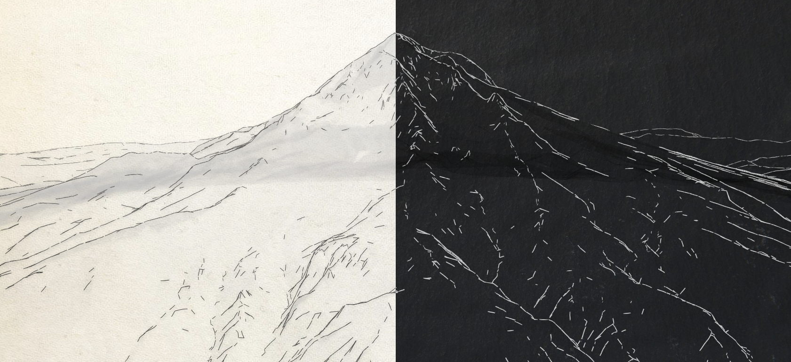

# Sketch the city

Displays Mt Hood as a hand drawn 3D sketch. There are 2 styles available: chalk on blackboard and pencil on canvas. Here are the 2 styles applied on a webscene of Mt Hood:

**Inspiration**: [Raluca Nicola](https://twitter.com/nicolaraluk) built her Sketch the city app and I was interested to see what this would look like for mountains. This is a fork of her project but applied to a mountain.

**How it works**: The API loads a [WebScene](https://developers.arcgis.com/javascript/latest/api-reference/esri-WebScene.html) of a city created in the [SceneViewer](https://www.arcgis.com/home/webscene/viewer.html).
In this app a new WebScene is created where all the other layers are droped except the SceneLayers with the buildings. The SceneLayers have a renderer that shows the edges with a sketch line and the faces are semi-transparent. The [SceneView](https://developers.arcgis.com/javascript/latest/api-reference/esri-views-SceneView.html) that displays the WebScene has a transparent [background](https://developers.arcgis.com/javascript/latest/api-reference/esri-webscene-background-ColorBackground.html), so that an image of an old canvas or a blackboard can be seen behind it.